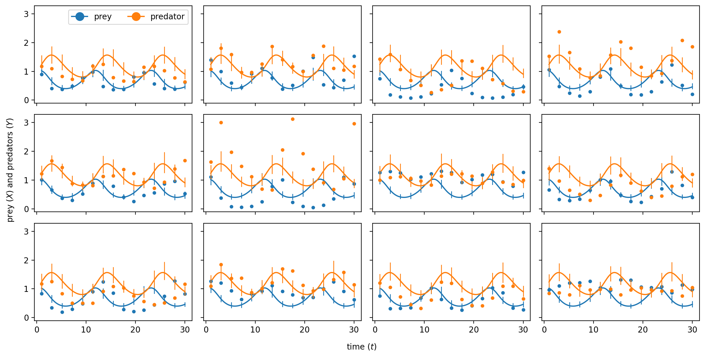
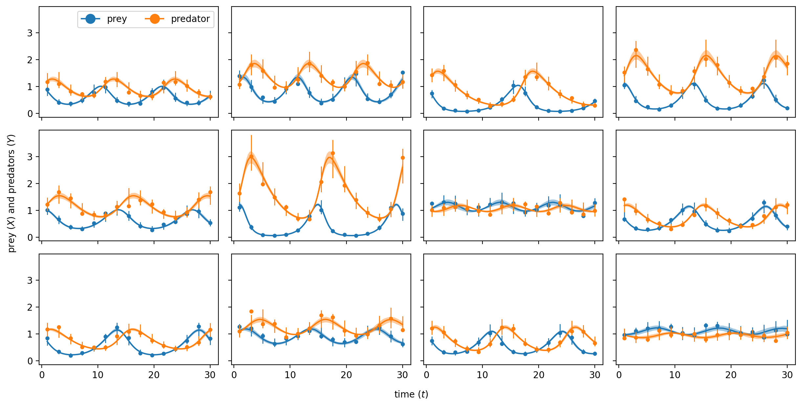

# Hierarchical Bayesian ODE Models using Stan

Python package to automatically generate Stan code for fitting hierarchical ODE models with Stan.
The integration of the ODEs is distributed over multiple CPU cores using Stan's `map_rect` function.

The type of data HBOMS is tailored to is panels of timeseries from replicate experiments or observations
where there is latent inter-unit variability in parameters. In the frequentist universe one would use
a non-linear random effects (or mixed effects) model. Writing such models in Stan is not that difficult,
but it is tedious and error prone, especially during model development and if one wants to test multiple 
model variants and assumptions about the parameters. 
HBOMS generates efficient, human readable, and correct Stan code from minimal user 
input. As models are constructed in python, Stan code can be generated programmatically, 
making it easier to compare a number of candicate models.
HBOMS provides methods to fit the Stan models to data, and inspect the results, but the generated code can also
and further developed independently from the HBOMS package.

Similar or related packages are `brms`, `Monolix` and `Torsten`.


## Installation

Download the source code from the github repository. For instance with
```bash
$ git clone git@github.com:chvandorp/hboms.git
```
Then create a virtual environment with `venv` and activate (this is optional)
```bash
$ python3 -m venv myvenv
$ source myvenv/bin/activate
```
Here "myvenv" can be any name you want. Then install `hboms` with `pip`
```bash
(myvenv) $ pip install path/to/hboms
```
We can now `import hboms` in a python session in the virtual environment myvenv

## Simple example

Consider the Lotka-Volterra model with an equation for prey $dx/dt = ax - bxy$,
and predators $dy/dt = cxy - dy$. We would write this is Stan as
```stan
ddt_x = a*x - b*x*y;
ddt_y = c*x*y - d*y;
```
Of course, we would also have to declare state variables `x` en `y`, their time
derivatives `ddt_x` and `ddt_y` and the parameters `a`, `b`, `c` and `d`.
However, HBOMS will manage all these declarations for you. In python,
we first import the `hboms` module and define a string containing the ODE model
```python
import hboms

ode_model = """
ddt_x = a*x - b*x*y;
ddt_y = c*x*y - d*y;
"""
```
Additionally, we have to specify the initial condition. For this, we have to
specify $x(0)$ and $y(0)$ in terms of the parameters. For state variables
`x` and `y`, the initial values are names `x_0` and `y_0`.
```python
init = """
x_0 = x0;
y_0 = y0;
"""
```
where `x0` and `y0` are two more parameters that we have to extimate.

Speaking of parameters, we next have to specify the types of all parameters in the model
```python
params = [
    hboms.Parameter("a", 0.8, "random"), # name, initial guess, type
    hboms.Parameter("b", 0.7, "random"),
    hboms.Parameter("c", 0.6, "random"),
    hboms.Parameter("d", 0.4, "random"),
    hboms.Parameter("x0", 1.0, "const"), # initial conditions
    hboms.Parameter("y0", 1.0, "const"),
    hboms.Parameter("sigma", 0.1, "fixed") # measurement error
]
```
the parameters $a, b, c$ and $d$ have random effects, i.e. the are unobserved
random variables that vary between different replicates of the experiment.
The parameter $\sigma$ determines the
magnitude of the measurement error and is the same for all the experiments
(this assumption can be relaxed). By default, parameters are restricted to be 
positive.

In addition to the parameters, we have to specify the state variables
```python
state = [hboms.Variable("x"), hboms.Variable("y")]
```
and observations
```python
obs = [hboms.Observation("X"), hboms.Observation("Y")]
```
We then have to specify distributions (of likelihood functions)
to couple the observations to the model predictions. Here we assume that
`X` and `Y` have a log-normal distribution with location parameters `log(x)` and
`log(y)` and scale parameter `sigma`.
```python
dists = [
    hboms.StanDist("lognormal", "X", params=["log(x)", "sigma"]),
    hboms.StanDist("lognormal", "Y", params=["log(y)", "sigma"])
]
```
The parameters for these distributions can be arbitrary Stan expressions.
The first argument `"lognormal"` is the name of the log-normal distribution
defined natively in Stan.

We then combine all components into a `HbomsModel` objects, which then
"transpiles" the model into Stan code, which is transpiled into C++
by Stan and compiled into an executable.
```python
hbm = hboms.HbomsModel(
    name = "lotka",
    odes = ode_model,
    init = init,
    params = params,
    state = state,
    obs = obs,
    dists = dists
)
```
To see what Stan code HBOMS generated, a utility is provided that works
best in Jupyter notebooks:
```python
hboms.utilities.show_stan_model(hbm.model_code)
```
This displays the complete Stan model with appropriate syntax highlighting.

An HBOMS model expects a data set given as a Python dictionary with keys
`"Time"` for time points per unit, and keys for all the observations.
In this case we have to provide keys `"X"` and `"Y"`. As an example,
we could have
```python
example_data = {
    "Time" : [
        [1, 2, 3, 4, 5],   # unit 1 has 5 observations
        [1, 2.5, 3, 4],    # unit 2 has 4 observations
        [1, 3, 4, 5, 6, 7] # unit 3 has 6 observations
    ],
    "X" : [
        [0.4, 0.3, 0.1, 0.2, 0.5], # X- data for unit 1
        [0.4, 0.2, 0.05, 0.3],
        [0.35, 0.12, 0.25, 0.55, 0.3, 0.1]
    ],
    "Y" : [
        [0.1, 0.45, 0.33, 0.09, 0.24], # Y-data for unit 1
        [0.03, 0.41, 0.22, 0.07],
        [0.12, 0.38, 0.1, 0.23, 0.6, 0.5]
   ]
}
```
This is just to show the structure of the expected dataset.
HBOMS can also be used to generate pseudo-data for quick testing
and model validation using the method `hbm.simulate`.

For now, lets assume that you have prepared a dataset `data` according to the
template `example_data`. To check if the initial parameter values are any
good, we can compare the simulated trajectories with the data using
```python
fig = hbm.init_check(data)
```



This shows the data for each unit in a separate panel, together with the
simulated trajectories based on the initial parameter guess. If the initial
guess is OK, we can fit the Stan model to the data:
```python
hbm.sample(
    data,
    iter_warmup=200,
    iter_sampling=200,
    step_size=0.01,
    refresh=1,
    chains=1,
    threads_per_chain=12
)
```
the keyword arguments `iter_warmup` etc. are all passed to the `CmdStanPy`
sample method (see the documentation of `CmdStanModel.sample`). Internally,
the `data` dictionary is modified to make it compatible with the data structure
that the Stan model expects. For instance, Stan does not allow rugged data as
in the `example_data`. So padding is applied. Also, possible constant parameters
are added to the data.
The `step_size` keyword argument is quite important. If you have chosen good
initial parameter values, then you don't want to make `step_size` too large
as a large initial step size for the HMC algorithm will make it likely that
the sampler quickly walks away from your carefully chosen parameters, before
the HMC hyperparameters can be optimized.
The `threads_per_chain` argument will determine how many CPU threads are
used in parallel to run the model. If you have the luxary of access to many
CPU cores, you can set this equal to the number of units, such that each initial
value problem is solved on a different core.

After sampling is complete, you can check the quality of the fit using
```python
fig = hbm.post_pred_check(data)
```




We can now extract the fitted Stan model and get access to the posterior
parameter distributions as follows:

```python
a_hat = hbm.fit.stan_variable("a") # hbm.fit is a CmdStanMCMC object
```

## Tutorials

In the folder `notebooks` there are a number of tutorials, demonstrating the features of HBOMS. 
*Currently there are only two notebooks about epidemic models, and within-host infection data with censored observations. This collection will grow!*
